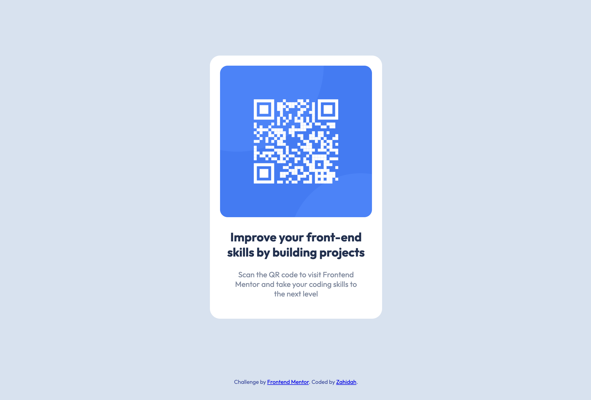

# Frontend Mentor - QR code component solution

This is a solution to the [QR code component challenge on Frontend Mentor](https://www.frontendmentor.io/challenges/qr-code-component-iux_sIO_H). Frontend Mentor challenges help you improve your coding skills by building realistic projects. 

## Table of contents

- [Overview](#overview)
  - [Screenshot](#screenshot)
  - [Links](#links)
- [My process](#my-process)
  - [Built with](#built-with)
- [Author](#author)

## Overview

### Screenshot

### Links

- Solution URL: [Github](https://github.com/iyraa/QR-code-component.git)
- Live Site URL: [Github](https://iyraa.github.io/QR-code-component/)

## My process

### Built with

- HTML
- CSS 

## Author

- Website - [Zahidah](https://iyda.design)
- Frontend Mentor - [@iyraa](https://www.frontendmentor.io/profile/iyraa)

